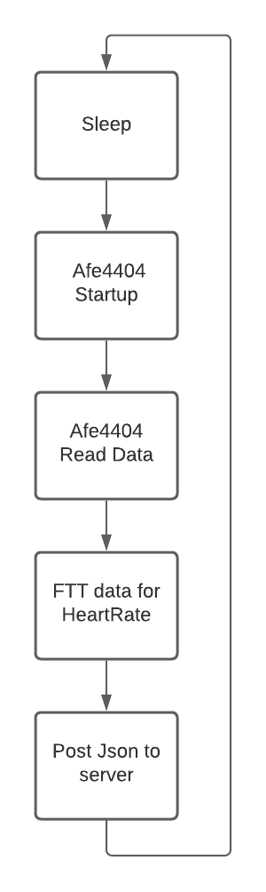
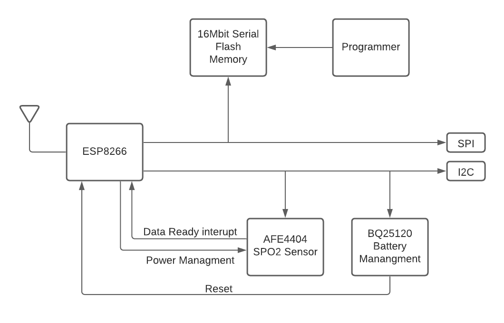

# How to flash the code on to the ESP8266
## First you must install the following toolchain, it consists of 2 parts:
### ESP8266_RTOS_SDK: https://github.com/espressif/ESP8266_RTOS_SDK
### ESP-IDF toolchain: https://docs.espressif.com/projects/esp-idf/en/latest/esp32/get-started-legacy/linux-setup.html
## Secondly you can clone this repository and enter the created folder
## Thirdly we flash the firmware
The configuration can be set by exectuting the folowing command *$ make menuconfig* here we can configure the wifi ssid an password.
You can enter *$ make flash* for flashing to the esp. Do make sure that your user can read and write to the serial device.
If you also wish to have your terminal print the debugging info you can enter *$ make flash monitor*.

# Hardeware
## Microcontroller
The microcontroller we used is the esp8266.
## SPO2 Sensor
The used SPO2 sensor and chip used for testing where the afe4404 (adc/controller), vemd8080 (fotodiode) and 2 green leds.

# Block digram
## Envisioned procedure for the Firmware

## Fysical connection on the pcb

# TODO:
## PCB:
### Change mosfets to n-channel
### Link: https://easyeda.com/skyper100mc/espwatch
## Code:
### Refactor for open/closed behavior
Refactor for this behavior and better documentation of the code. Also splitting the code up into more *classes* so that the code is less confusing to read.
#### I2C code needs to be split off
I2C code needs to be split off so we can use it for implementing the battery management.
#### Wifi, http request code
This code needs to be moved to separate file and the functionality revised for using in our application.
### Implement debug setting
Implementing of a debug stetting for easier debuging code.
### Sensor tuning
Tunning the settings for the sensor so the readout data is more accurate.
### Implementing battery management
We have chosen a chip for battery management. But we haven't implemented it yet.
### Implement Power management

# Important comments
## TIA Gain
This amplification filter is esential for filtering out the high interfierace bit it can allsow affect the amplitude of the signal
## I_DC_Offset
This Value is important to change if the singal seems to clip, so that the adc can convert it but it allso affects the TIA-Gain